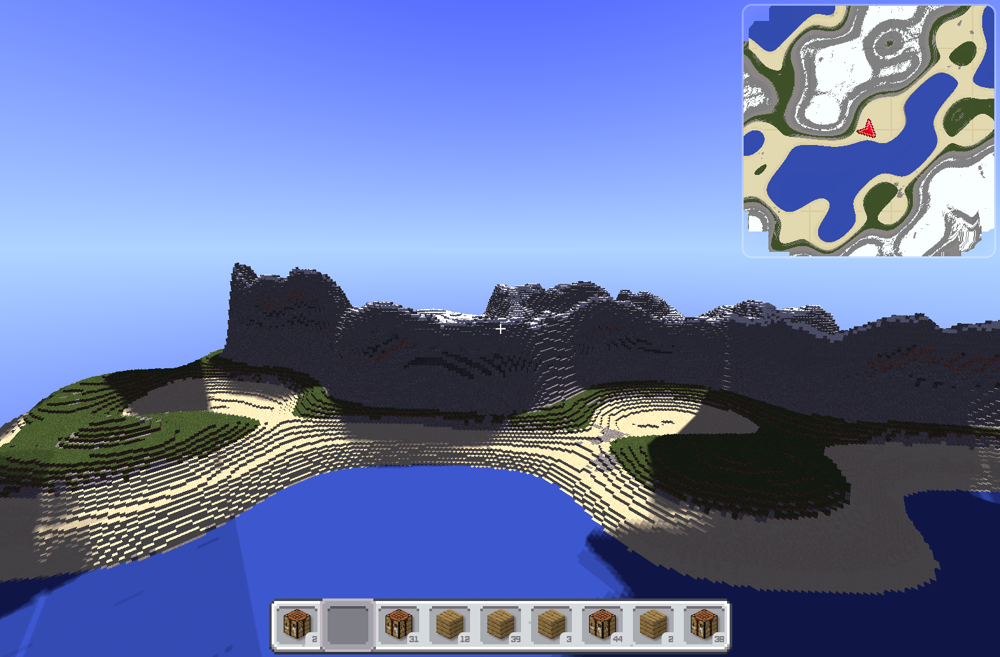

# Typecraft

A Minecraft-inspired voxel engine built from scratch using **WebGPU** and **TypeScript**. Runs in the browser or as a desktop app via Electron.

> **Work in progress.** Features, performance, and APIs are subject to change.



## Tech Stack

| Layer    | Technology              |
| -------- | ----------------------- |
| Language | TypeScript              |
| Graphics | WebGPU (WGSL shaders)   |
| UI       | React 19 + Tailwind CSS |
| Desktop  | Electron                |
| Build    | Vite                    |
| State    | Zustand                 |
| Math     | wgpu-matrix             |

## Features

### Rendering

- Multi-pass GPU rendering with 6 render pipelines (sky, blocks, outlines, destroy, ghost, post-processing)
- Voxel cone tracing for global illumination, soft shadows, and ambient lighting
- GPU-driven frustum culling via compute shaders
- Procedural sky with FBM cloud rendering

### World Generation

- Procedural terrain with 5 biomes: Ocean, Desert, Plains, Mountains, and Snow
- Domain warping and ridged multifractal noise for natural-looking terrain
- Strata layering with slope-based block selection
- Parallel chunk generation using Web Workers

### Gameplay

- 46 block types with multiple mesh shapes (cubes, slabs, stairs, fences)
- Block placement and destruction with progressive damage stages
- Inventory system with crafting table support
- Creative mode toggle
- Collision detection and physics

### UI

- Minecraft-style inventory and hotbar
- Zoomable real-time minimap
- Pause menu with settings
- Spyglass zoom (hold Z)
- Debug stats overlay (FPS, position, biome, chunk counts)

### Audio

- Per-block dig and mining sound effects (stone, wood, azalea leaves)

## Getting Started

### Prerequisites

- Node.js (v18+)
- npm
- A GPU with WebGPU support

### Install

```bash
npm install
```

### Run (Electron)

```bash
npm run electron:dev
```

This starts the Vite dev server, watches Electron TypeScript, and launches the app in development mode with DevTools.

### Run (Browser only)

```bash
npm run dev
```

Open `http://localhost:5173` in a WebGPU-compatible browser.

### Build for Production

```bash
npm run electron:build
```

## Keybinds

| Key                 | Action                                 |
| ------------------- | -------------------------------------- |
| **W / A / S / D**   | Move forward / left / backward / right |
| **Space**           | Jump (survival) or fly up (creative)   |
| **Control**         | Fly down (creative mode only)          |
| **Left Mouse**      | Break block                            |
| **Right Mouse**     | Place block                            |
| **Scroll Wheel**    | Cycle hotbar slot                      |
| **E**               | Open/close inventory                   |
| **Escape / P**      | Pause menu                             |
| **C**               | Toggle creative mode                   |
| **T**               | Toggle crafting table                  |
| **Z**               | Spyglass zoom (hold)                   |
| **Arrow Up / Down** | Decrease / increase FOV                |
| **+ / -**           | Zoom minimap in / out                  |
